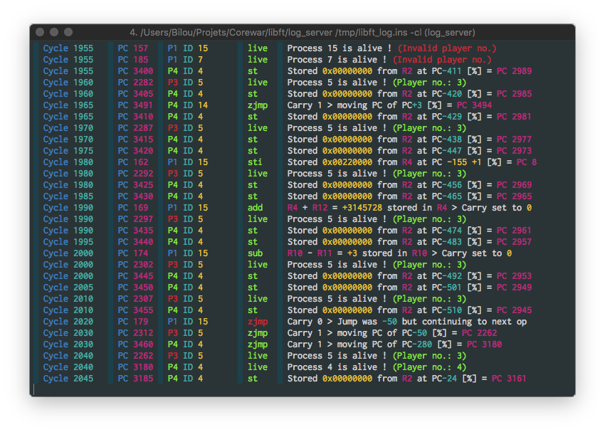
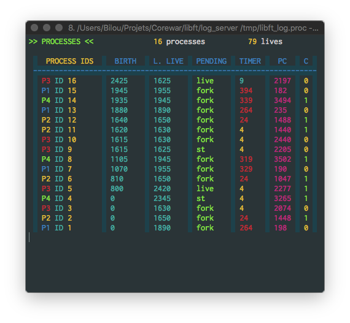

# Corewar
 "Corewar is a very special programming game created by D. G. Jones and A. K. Dewdney in 1984."
 "It consists in gathering around a virtual machine one to four players."
This players will load champions who will fight with processes, in order, among other things, to make sure that they are told they are alive.  

Processes run sequentially within the same virtual machine, and from the same memory space.  
They can, for example, write to each other in order to corrupt others processes, force others to execute instructions that hurt them, try to recreate on the fly the equivalent software of a Côtes du Rhône 1982, etc ...  

The game ends when no more processes are alive. At this point, the winner is the last player to be reported as alive.  

Note :  
```
This is an alternative version of the original game. The virtual machine does not work the same way, and the assembly language is a bit different of the original Redcode, but the game spirit is still the same.

Original Core War wiki here : [Original Core War wiki page](https://en.wikipedia.org/wiki/Core_War)

This code has only been tested on macOS 10.11+
```

## Modules

### Assembler

### Virtual machine

## Screen captures

 "Debug level 1 : Game status"

 "Debug level 2 : Arena content"

 "Debug level 4 : Instructions history"

 "Debug level 8 : Intructions details"

 "Debug level 16 : Processes list & infos"

 "Debug level 36 : Processes registers"

 "Visualizer start screen"

## Usage

First, clone
```sh
$ git clone https://github.com/bil0u/corewar.git
```

A Makefile is provided, just run in your shell
```sh
$ make
```
or call it from a parent one with the rule `make -C <corewar_path>`

## License

This project is licensed under the GNU General Public License v3.0 - see the [LICENSE.txt](LICENSE.txt) file for details
