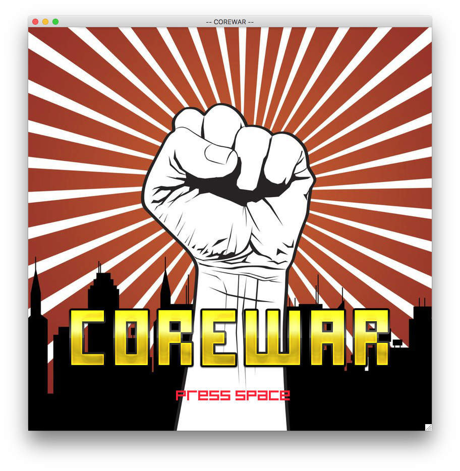
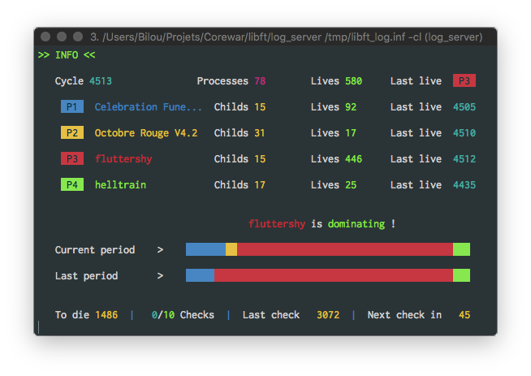
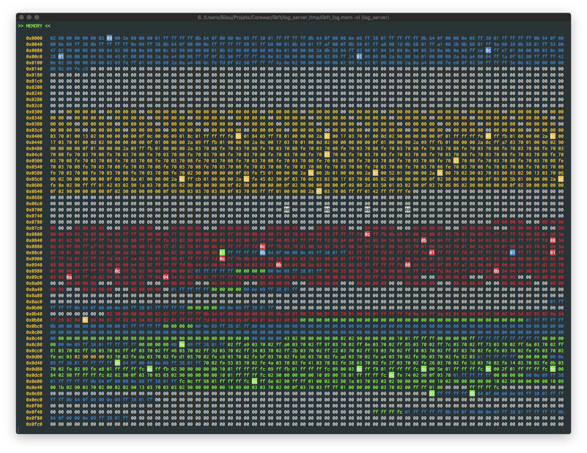
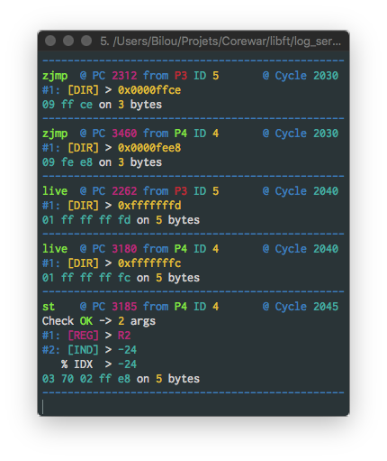

# Corewar
 "Corewar is a very special programming game created by D. G. Jones and A. K. Dewdney in 1984."
 "It consists in gathering around a virtual machine one to four players."
This players will load champions who will fight with processes, in order, among other things, to make sure that they are told they are alive.  

Processes run sequentially within the same virtual machine, and from the same memory space.  
They can, for example, write to each other in order to corrupt others processes, force others to execute instructions that hurt them, try to recreate on the fly the equivalent software of a Côtes du Rhône 1982, etc ...  

The game ends when no more processes are alive. At this point, the winner is the last player to be reported as alive.  

```
This is an alternative version of the original game.
> The virtual machine does not work the same way
> The assembly language is a bit different of the original Redcode
```

Original Core War wiki [here](https://en.wikipedia.org/wiki/Core_War)  

This code has only been tested on macOS 10.11+

## Setup

### Requirements

This project use `sdl`, `sdl_image` and `sdl_ttf` libraries.  

In order to get the program compile properly you have to install them.  
You can use [homebrew](https://brew.sh) to simply do this by typing the following
```sh
$ brew install sdl sdl_image sdl_ttf
```

### Compiling

First, clone and pull the submodules
```sh
$ git clone https://github.com/bil0u/corewar.git
...
$ git submodule update --init
```

The main Makefile has several rules:  

* `all`  
   Calls `lib`, `asm` and `vm` rules
* `lib`  
   Compile only the `libft` submodule
* `asm`  
   Compile the `libft` if needed and build the `asm` binary
* `vm`  
   Compile the `libft` if needed and build the `corewar` binary
* `champs`  
   Build the `asm` if not existing and use it to compile all `.s` files in the `champs` directory
* `tests`  
   Build the `asm` if not existing and use it to compile all `.s` files in the `champs` directory
* `clean`  
   Delete all `.o` & `.cor` files
* `fclean`  
   Calls the `clean` rule and delete `asm` & `corewar` binaries
* `re`  
   Calls `fclean` and `all` rules
* `norm`  
   Runs the `norminette` command on all the `sources` and `includes` subdirectories (Works only in 42 clusters)

## Modules

### Assembler

This is the program that will compile your champions and translate them from text to a `bytecode`, namely a machine code that will be directly interpreted by the virtual machine.  

Usage  
```
$ ./asm [file.s ...]
```

### Virtual machine

This is the `arena` in which the champions will fight. It offers many features, all of them are useful in the battle. It goes without saying that it makes it possible to execute several processes simultaneously.  

Usage  
```
$ ./corewar [-a] [-z] [-S N] [-v N] [-D N] [-d N -s N | -V --stealth --mute] [[-n N] file.cor ...]
```

#### Options

* `-a`  
   Prints output of `aff` instruction (hidden by default)  
* `-z`  
   Reproduces the same bugs as the reference VM given @ 42  
* `-n N`  
   Manually set the player number of the following champion  
* `-S N`  
   Set the execution speed limit at N cycles/seconds  
* `-v N`  
   Set the verbose level. You can add the values. `-v 19` will print the lives, cycles and PC movement informations.  
   0   -  Show only essentials (default)  
   1   -  Show lives  
   2   -  Show cycles  
   4   -  Show operations Args are NOT litteral  
   8   -  Show deaths  
   16  -  Show PC movements  
* `-D N` (See lower important note)  
   This mode uses many system calls and slows the program a lot, use with care.  
   Set the verbose level. You can add the values. `-D 19` will print the game infos, the arena and the processes list.  
   1   -  Show game informations  
   2   -  Show the arena memory zone  
   4   -  Show instructions history  
   8   -  Show instructions details  
   16  -  Show processes details  
   32  -  Show processes registers  
* `-d N`  
   Dumps memory after N cycles then exits  
* `-s N`  
   Runs N cycles, dumps, pauses, repeat  
* `-V`  
   SDL output mode  

#### Controls

In order to be catched, keyboard input for controls needs to be done with focus on the terminal window used to launch the vm binary, as it uses `read` on STDIN to catch events.  

* `<space>`  
   Pause / Resume the game  
* `Return`  
   Execute the next cycle, useful for step-by-step debug  

If launched in debug or visualizer mode, the game is paused by default.

---
`IMPORTANT NOTE`  

Debug mode only works on macOS 10.11+ if app `iTerm` (Free) is installed.
This is because of the script used to create new windows and launch the logging binary.

You can manually launch a log session in a newly opened terminal window by typing the following
```sh
$ <main_directory>/libft/log_server /tmp/libft_log.<window_name> [-scl]
```
* `<main_directory>`  
   This is the path where you cloned this project  
* `<window_name>`  
   | Name to type | Debug level |  
   |:------------:|:-----------:|  
   |    `inf`     |     1       |  
   |    `mem`     |     2       |  
   |    `ins`     |     4       |  
   |    `arg`     |     8       |  
   |    `job`     |     16      |  
   |    `reg`     |     32      |  
* `-s`  
   Save all printed output in a log file, in the `<main_directory>/libft/log_files` directory  
* `-c`  
   Close the terminal window when the log_server stops  
* `-l`  
   Keep the log_server running even if the parent program is terminated  
   This allow you to use the same debug windows for your game sessions, and not to have to resize them each time you launch the game  

To close a window properly, you must press `Ctrl + C` in it.  
If you kill the program by any other way, the log server will not suppress the used fifo, and you will encouter problems for launching a new session. (Your programm will stuck do nothing)  

If this happens, you can reset the logging fifos by typing  
```
$ rm -f /tmp/libft_log.*
```
---

## Some screen captures

* Visualizer start screen  
     

* Debug level 1 : Game status  
     

* Debug level 2 : Arena content  
     

* Debug level 4 : Instructions history  
     

* Debug level 8 : Intructions details  
     

* Debug level 16 : Processes list & infos  
     

* Debug level 36 : Processes registers  
     

## License

This project is licensed under the GNU General Public License v3.0 - see the [LICENSE.txt](LICENSE.txt) file for details
